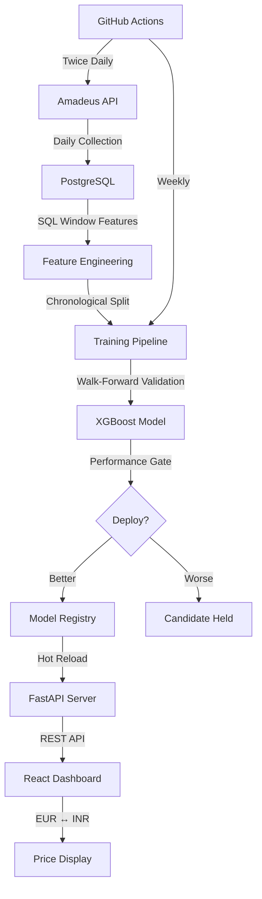

# iFly — Flight Price Intelligence System


A production-grade flight price prediction system with self-improving ML deployment, deterministic inference, and strict operational safeguards.

<!-- Add your live demo link here after deployment -->
<!-- 🌐 **[Live Demo](https://your-app.vercel.app)** -->

## Architecture



## Tech Stack

| Layer | Technology |
|-------|-----------|
| **Backend** | FastAPI, SQLAlchemy, PostgreSQL, Alembic |
| **ML** | XGBoost, scikit-learn, pandas, NumPy |
| **Frontend** | React 18, Vite, Tailwind CSS |
| **CI/CD** | GitHub Actions (daily collection, weekly retrain) |
| **Hosting** | Render (backend), Vercel (frontend) |
| **Data** | Amadeus Flight Offers API |

## How to Run Locally

### Backend

```bash
cd backend
python -m venv venv
source venv/bin/activate
pip install -r requirements.txt

# Configure environment
cp .env.example .env
# Edit .env with your DATABASE_URL and AMADEUS keys

# Run migrations
alembic upgrade head

# Start server
uvicorn app.main:app --reload --port 8000
```

### Frontend

```bash
cd frontend
npm install

# Configure environment
cp .env.example .env
# Edit .env if backend is not on localhost:8000

npm run dev
```

Dashboard available at `http://localhost:5173`

## Cloud Deployment

### Backend → Render (Free Tier)

1. Go to [render.com](https://render.com) → **New → Web Service**
2. Connect your GitHub repository
3. Configure:

| Setting | Value |
|---------|-------|
| **Root Directory** | `backend` |
| **Build Command** | `pip install -r requirements.txt` |
| **Start Command** | `uvicorn app.main:app --host 0.0.0.0 --port $PORT` |

4. Add environment variables:

| Variable | Value |
|----------|-------|
| `DATABASE_URL` | Your PostgreSQL connection string |
| `AMADEUS_API_KEY` | Your Amadeus key |
| `AMADEUS_API_SECRET` | Your Amadeus secret |
| `ENV` | `production` |
| `PYTHON_VERSION` | `3.11.0` |

5. Deploy → test at `https://your-backend.onrender.com/health`

### Frontend → Vercel (Free Tier)

1. Go to [vercel.com](https://vercel.com) → **Import Project**
2. Connect your GitHub repository
3. Configure:

| Setting | Value |
|---------|-------|
| **Root Directory** | `frontend` |
| **Framework** | Vite |
| **Build Command** | `npm run build` |
| **Output Directory** | `dist` |

4. Add environment variable:

| Variable | Value |
|----------|-------|
| `VITE_API_BASE_URL` | `https://your-backend.onrender.com` |

5. Deploy → live at `https://your-app.vercel.app`

## Environment Variables

| Variable | Where | Required | Description |
|----------|-------|----------|-------------|
| `DATABASE_URL` | Backend | ✅ | PostgreSQL connection string |
| `AMADEUS_API_KEY` | Backend | ✅ | Amadeus API key |
| `AMADEUS_API_SECRET` | Backend | ✅ | Amadeus API secret |
| `ENV` | Backend | ❌ | `development` (default) or `production` |
| `LOG_LEVEL` | Backend | ❌ | Logging level (default: `INFO`) |
| `VITE_API_BASE_URL` | Frontend | ❌ | API base URL (default: `http://localhost:8000`) |

## ML Pipeline

### Training (Walk-Forward Validation)

1. Data loaded with SQL window features (rolling means, volatility, momentum)
2. Chronological rolling splits (90-day train → 14-day test windows)
3. XGBoost trained with `log1p` target transformation
4. Inference reversed with `expm1`
5. Permutation test guards against data leakage
6. Correlation sanity test detects multicollinearity

### Deployment Gate

New models deploy **only if strictly better** on the same holdout slice:

```
new_test_r2  > deployed_test_r2  AND  new_test_mae < deployed_test_mae
```

No tolerance margins. No rounding. No relaxed thresholds.

### Hot Reload

The API polls the model registry and performs atomic model swaps when a new deployed version is detected. Zero downtime.

## Production Safeguards

| Safeguard | Description |
|-----------|-------------|
| **Deployment Gate** | Candidate vs deployed evaluated on identical validation slice |
| **Permutation Test** | Shuffled-target R² must be < 0.05 or deployment aborts |
| **Temporal Integrity** | SQL windows use `1 PRECEDING` (excludes current row) |
| **Numeric Guards** | Finite check, positive enforcement, upper bound warning |
| **Single Active Model** | Partial unique index ensures exactly one `deployed=TRUE` |
| **Fail-Fast Startup** | Missing model/metadata → `RuntimeError` (no silent fallback) |
| **CORS Control** | Wildcard only in development; explicit origins in production |
| **No Secrets in Git** | `.env` excluded, all secrets via environment variables |
| **Structured Logging** | All output via Python `logging` module |
| **Feature Column Lock** | Feature order stored in metadata, enforced at inference |

## Project Structure

```
iFly/
├── backend/                       # FastAPI Backend
│   ├── app/
│   │   ├── main.py                # FastAPI app + CORS
│   │   ├── config.py              # Pydantic settings
│   │   ├── database.py            # SQLAlchemy engine
│   │   ├── models/                # ORM models
│   │   ├── routers/               # API endpoints
│   │   ├── schemas/               # Pydantic schemas
│   │   └── services/              # Business logic
│   ├── ml/
│   │   ├── train.py               # Walk-forward training
│   │   ├── retrain_pipeline.py    # Automated retrain + gate
│   │   ├── feature_engineering.py # SQL window features
│   │   └── ml_audit.py            # Model audit utilities
│   ├── data_collector/            # Amadeus data collection
│   ├── migrations/                # Alembic migrations
│   ├── models/                    # Model artifacts (.gitignored)
│   ├── requirements.txt
│   └── .env.example
├── frontend/                      # React Dashboard
│   ├── src/
│   │   ├── App.jsx
│   │   ├── api.js                 # Centralized API client
│   │   ├── components/
│   │   └── pages/
│   ├── package.json
│   └── .env.example
├── .github/workflows/
│   ├── daily-collector.yml
│   └── weekly-retrain.yml
├── ARCHITECTURE_NOTES.md
├── README.md
└── .gitignore
```

## License

MIT
