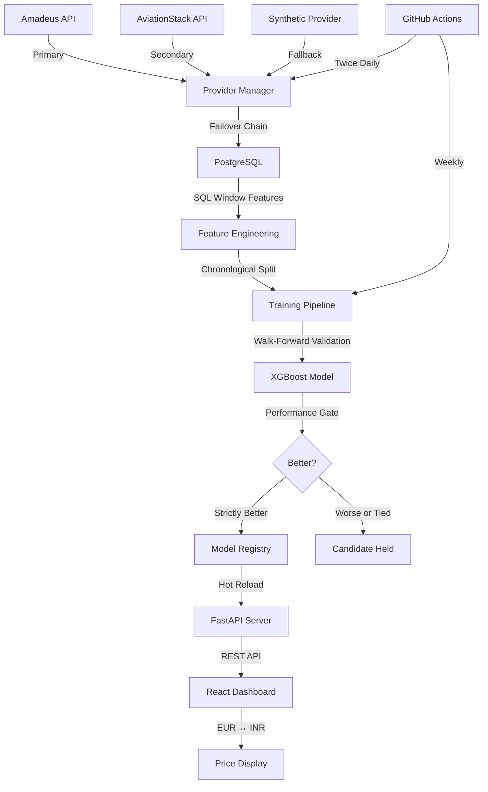

# iFly — Flight Price Intelligence System


A production-grade flight price prediction system that collects live airline pricing data, trains self-improving ML models with strict leakage prevention, and deploys them through an automated performance gate — all orchestrated through a real-time React dashboard.

🌐 **[Live Demo](https://i-fly-two.vercel.app)** · 📡 **[API Docs](https://ifly-fam5.onrender.com/docs)** · 📊 **[Backend Health](https://ifly-fam5.onrender.com/health)**

---

## Problem Statement

Flight prices are notoriously unpredictable. The same route can vary by hundreds of dollars depending on timing, airline, demand, and booking window. Existing price prediction tools suffer from:

- **Data leakage** — using future information during training, producing artificially inflated accuracy
- **Static models** — trained once and never updated as market conditions change
- **No deployment safeguards** — new models replace old ones without verifying they're actually better
- **Opaque predictions** — users can't see how or why a price was predicted

**iFly solves these problems** by building a complete, self-improving ML pipeline that:
1. Collects real pricing data from the Amadeus API twice daily
2. Engineers features using SQL window functions that are inherently leakage-proof
3. Trains models with chronological splits (never peeking at future data)
4. Deploys new models **only if they strictly outperform** the current one
5. Surfaces everything through a transparent, interactive dashboard

---

## System Overview

In plain terms, here's what iFly does end-to-end:

1. **Data Collection** — A scheduled pipeline collects flight pricing data twice daily using a **three-provider failover chain**: Amadeus API (real pricing) → AviationStack API (real schedules + estimated pricing) → Synthetic Provider (DB-backed Gaussian estimates). It rotates through 50 curated routes, respects API quotas, handles rate limits with exponential backoff, and deduplicates offers using SHA-256 hashes.

2. **Feature Engineering** — Raw pricing data is enriched with rolling statistics (30-day means, 7-day volatility, price momentum) computed via SQL window functions. These windows use `ROWS BETWEEN 30 PRECEDING AND 1 PRECEDING` — the `1 PRECEDING` boundary ensures the current row's data is never included, eliminating temporal leakage at the database level.

3. **Model Training** — An XGBoost regressor is trained with walk-forward validation on chronologically sorted data. The target variable is `log1p`-transformed to handle right-skewed price distributions, and predictions are reversed with `expm1`.

4. **Self-Improving Pipeline** — Weekly, a new model is trained and evaluated against the currently deployed model on an identical test slice. The new model deploys **if and only if** it achieves both higher R² and lower MAE. No tolerance margins, no relaxed thresholds.

5. **Live Dashboard** — A React frontend provides real-time price inference, model transparency metrics, system health monitoring, and a stress test engine for load testing the prediction API.

---

## Architecture



### Multi-Provider Ingestion

The data collection pipeline uses a deterministic failover chain to ensure **continuous data flow** even when APIs are exhausted:

| Priority | Provider | Source | Quota | Data Type |
|----------|----------|--------|-------|-----------|
| 1️⃣ | **Amadeus** | Real API pricing | 2,000/month | Real flight offers with actual prices |
| 2️⃣ | **AviationStack** | Real schedules + DB pricing | 100/month | Real flight schedules, historical price estimates |
| 3️⃣ | **Synthetic** | DB-backed Gaussian | 200/day | Realistic estimates from route statistics |

#### Why Multi-Provider? The Problem It Solves

Free-tier APIs are the biggest bottleneck in personal ML projects. Amadeus provides 2,000 calls/month — enough for ~20 collection runs. Without failover, the pipeline **stops collecting data** once the quota is hit, and the ML model's accuracy degrades over time as training data becomes stale.

The multi-provider architecture solves this with **graceful degradation**:

```
Amadeus quota exhausted (HTTP 429) 
  → AviationStack takes over (real flight schedules + estimated pricing)
    → AviationStack quota exhausted (100/month)
      → Synthetic provider fills in (DB-backed Gaussian estimates, 200/day cap)
        → Data never stops flowing ✅
```

**Verified test results** (Feb 2026):
```
Amadeus:        0/2   successful (quota exhausted — 429 errors)
AviationStack:  28/100 successful (real flight data for 28 routes)
Synthetic:      61/61  successful (DB-backed fallback for remaining routes)
Total:          275 offers inserted into PostgreSQL ✅
```

#### Is It Useful? Why Does This Matter?

| Without Multi-Provider | With Multi-Provider |
|----------------------|---------------------|
| API quota hit → data collection **stops** | API quota hit → **failover** to next provider |
| Model retraining uses **stale** data | Model always has **fresh** training data |
| Empty gaps in historical data | **Continuous** data flow, no gaps |
| Single point of failure | **Resilient** — 3 independent data sources |
| Portfolio project looks **fragile** | Demonstrates **production-grade** engineering |

**Key design decisions:**
- All providers implement the same `FlightProviderInterface` — the downstream ML pipeline doesn't know or care which provider generated the data
- Every offer is tagged with `provider_name` (`amadeus`, `aviationstack`, `synthetic`) for traceability
- Synthetic data is **capped at 200/day** and clearly tagged to prevent data pollution
- The provider abstraction makes adding new APIs (Kiwi, Skyscanner, etc.) trivial — just implement the interface


### Backend Architecture

| Layer | Technology | Purpose |
|-------|-----------|---------|
| **API Framework** | FastAPI | REST endpoints, async support, auto-docs |
| **ORM** | SQLAlchemy 2.0 | Type-safe database operations |
| **Database** | PostgreSQL (Supabase) | Persistent storage, SQL window features |
| **Migrations** | Alembic | Schema versioning |
| **ML Training** | XGBoost + scikit-learn | Model training with walk-forward validation |
| **Serialization** | Joblib | Model artifact persistence |
| **Scheduling** | GitHub Actions | Automated collection and retraining |

### Frontend Architecture

| Component | Purpose |
|-----------|---------|
| **PredictionCard** | Flight route input + price inference display |
| **ModelTransparencyPanel** | Model version, R², MAE, training timestamp |
| **SystemHealthPanel** | Routes, airlines, data points, API status |
| **StressTestPanel** | Automated load testing across multiple routes |

---

## Machine Learning Approach

### Why Chronological Split?
Standard random train/test splits allow future data to leak into the training set. In time-series pricing data, this is catastrophic — the model learns patterns it would never have access to in production. iFly sorts all data by `created_at` and splits at the 80th percentile, ensuring the training set contains only historically prior observations.

### Why SQL Window Functions for Features?
Features like `route_rolling_mean_30d` are computed using:
```sql
AVG(price) OVER (
    PARTITION BY origin, destination
    ORDER BY created_at
    ROWS BETWEEN 30 PRECEDING AND 1 PRECEDING
)
```
The key is `1 PRECEDING` — it excludes the current row, so each feature is computed from strictly past data. This prevents temporal leakage at the database level, making it structurally impossible to accidentally use current/future prices.

### Why Permutation Testing?
After training, all test features are randomly shuffled and fed through the model. If the shuffled-data R² exceeds 0.05, the model is flagged for potential leakage and deployment is aborted. This catches subtle data leakage that chronological splits alone might miss.

### Why a Deployment Gate?
Without a gate, every retrained model — even a worse one — would be deployed. iFly's gate requires:
```
new_test_r2 > deployed_test_r2  AND  new_test_mae < deployed_test_mae
```
Both conditions must be strictly satisfied. No tolerance margins. This ensures the system can only improve over time.

### Why `log1p` Target Transformation?
Flight prices are right-skewed (many cheap flights, few expensive ones). `log1p(y)` compresses the range during training, and `expm1(pred)` restores it during inference. This reduces the impact of outlier prices on the model's loss function.

### Feature Set (20 Features)
| Category | Features |
|----------|----------|
| **Spatial** | `distance_km` |
| **Temporal** | `month`, `weekday`, `departure_hour_bucket`, `days_until_departure` |
| **Flight** | `stops`, `duration_minutes` |
| **Route Statistics** | `route_rolling_mean_30d`, `route_rolling_std_30d`, `route_mean_7d`, `route_offer_count_7d`, `route_price_momentum`, `route_volatility_index` |
| **Airline Statistics** | `airline_route_mean_price`, `airline_route_mean_7d`, `airline_route_volatility_7d`, `airline_route_offer_count_7d`, `airline_price_relative_to_route_mean` |
| **Frequency Encoding** | `airline_freq`, `route_key_freq` |

---

## Stress Test Engine

The dashboard includes a built-in **System Stress Test Engine** that:

- Fires sequential inference requests across multiple routes (JFK→LHR, BOM→BLR, DEL→BOM, etc.)
- Measures **latency per request** (ms)
- Tracks **pass/fail** status for each route
- Computes an aggregate **health score** (percentage of successful predictions)
- Runs configurable batch sizes (4, 8, 16 runs)

**Why it exists:** In production ML systems, it's not enough to know the model is accurate — you need to verify the entire inference pipeline (API → model load → feature construction → prediction → response) works reliably under load.

---

## Currency System

- The backend stores and computes all prices in **EUR** (Amadeus API's default currency)
- The frontend applies a fixed **EUR → INR conversion rate (90.0)** client-side
- Users can toggle between EUR and INR display via the navigation bar
- **Why frontend-only?** Currency conversion is a display concern, not a model concern. Keeping the model in EUR avoids compounding exchange rate fluctuations into prediction error.

---

## Production Safeguards

| Safeguard | How It Works |
|-----------|-------------|
| **Deployment Gate** | New model vs. deployed model evaluated on identical test slice — both R² and MAE must improve |
| **Permutation Test** | Shuffled-feature R² must be < 0.05 or deployment aborts |
| **Temporal Integrity** | SQL windows use `1 PRECEDING` (excludes current row from all rolling calculations) |
| **Numeric Guards** | Finite check, positive enforcement, upper bound warnings on predictions |
| **Single Active Model** | Partial unique index `(deployed) WHERE deployed = TRUE` enforces exactly one active model |
| **CORS Control** | Wildcard in development, explicit Vercel domain in production |
| **No Secrets in Git** | All credentials via environment variables, `.env` excluded from repo |
| **Structured Logging** | All pipeline events via Python `logging` module with timestamps |
| **Feature Column Lock** | Feature order stored in model metadata, enforced at inference time |
| **Hot Reload** | API polls model registry and performs atomic model swaps — zero downtime |

---

## How to Run Locally

### Prerequisites
- Python 3.11+
- Node.js 18+
- PostgreSQL database (or use Supabase free tier)

### Backend

```bash
cd backend
python -m venv venv
source venv/bin/activate
pip install -r requirements.txt

# Configure environment
cp .env.example .env
# Edit .env with your DATABASE_URL and optional Amadeus keys

# Run database migrations
alembic upgrade head

# Start the API server
uvicorn app.main:app --reload --port 8000
```

Backend available at `http://localhost:8000/docs`

### Frontend

```bash
cd frontend
npm install

# Configure environment (optional — defaults to localhost:8000)
cp .env.example .env

# Start the development server
npm run dev
```

Dashboard available at `http://localhost:5173`

---

## Cloud Deployment

### Backend → Render (Free Tier)

1. Go to [render.com](https://render.com) → **New → Web Service**
2. Connect your GitHub repository
3. Configure:

| Setting | Value |
|---------|-------|
| **Root Directory** | `backend` |
| **Build Command** | `pip install -r requirements.txt` |
| **Start Command** | `uvicorn app.main:app --host 0.0.0.0 --port $PORT` |

4. Add environment variables:

| Variable | Required | Description |
|----------|----------|-------------|
| `DATABASE_URL` | ✅ | PostgreSQL connection string |
| `ENV` | ✅ | Set to `production` |
| `CORS_ORIGINS` | ❌ | Extra allowed origins (comma-separated) |
| `AMADEUS_API_KEY` | ❌ | Amadeus API key (primary data provider) |
| `AMADEUS_API_SECRET` | ❌ | Amadeus API secret |
| `AVIATIONSTACK_API_KEY` | ❌ | AviationStack API key (secondary provider, 100 free calls/month) |

> **Note:** Render's free tier has a cold start of ~50 seconds after 15 minutes of inactivity. The first request may be slow.

### Frontend → Vercel (Free Tier)

1. Go to [vercel.com](https://vercel.com) → **Import Project**
2. Connect your GitHub repository
3. Set **Root Directory** to `frontend`
4. Configure:

| Setting | Value |
|---------|-------|
| **Framework** | Vite |
| **Build Command** | `npm run build` |
| **Output Directory** | `dist` |

5. Add environment variable:

| Variable | Value |
|----------|-------|
| `VITE_API_BASE_URL` | `https://your-backend.onrender.com` |

---

## Project Structure

```
iFly/
├── backend/                       # FastAPI Backend
│   ├── app/
│   │   ├── main.py                # FastAPI app + CORS configuration
│   │   ├── config.py              # Pydantic settings (env vars)
│   │   ├── database.py            # SQLAlchemy engine + session
│   │   ├── models/
│   │   │   ├── flight_offer.py    # FlightOffer ORM (16 columns)
│   │   │   └── model_registry.py  # ModelRegistry ORM (partial unique index)
│   │   ├── routers/
│   │   │   ├── flight_search.py   # Amadeus search proxy
│   │   │   ├── price_prediction.py # Inference endpoint + model loading
│   │   │   └── system.py          # System health aggregations
│   │   ├── schemas/               # Pydantic request/response schemas
│   │   └── services/              # Business logic (Amadeus client)
│   ├── ml/
│   │   ├── train.py               # Walk-forward XGBoost training
│   │   ├── retrain_pipeline.py    # Automated retrain + deployment gate
│   │   ├── feature_engineering.py # SQL window features (20 features)
│   │   └── residual_stats.json    # Variance interval statistics
│   ├── data_collector/
│   │   ├── collector.py           # Multi-provider data collection pipeline
│   │   ├── routes.py              # 50 curated high-value routes
│   │   └── providers/             # Provider abstraction layer
│   │       ├── base.py            # FlightProviderInterface (abstract)
│   │       ├── amadeus_provider.py    # Amadeus API (primary)
│   │       ├── aviationstack_provider.py  # AviationStack (secondary)
│   │       ├── synthetic_provider.py  # DB-backed fallback
│   │       └── provider_manager.py    # Failover orchestration
│   ├── models/                    # Model artifacts (.pkl.gz)
│   ├── migrations/                # Alembic schema migrations
│   ├── requirements.txt
│   └── .env.example
├── frontend/                      # React + Vite Dashboard
│   ├── src/
│   │   ├── App.jsx                # Root layout + routing
│   │   ├── api.js                 # Centralized API client
│   │   └── components/
│   │       ├── PredictionCard.jsx  # Price inference form + results
│   │       ├── ModelTransparencyPanel.jsx # Model metrics display
│   │       ├── SystemHealthPanel.jsx # Database health metrics
│   │       └── StressTestPanel.jsx  # Load testing engine
│   ├── package.json
│   └── .env.example
├── .github/workflows/
│   ├── daily-collector.yml        # Twice-daily data collection
│   └── weekly-retrain.yml         # Weekly model retraining
├── ARCHITECTURE_NOTES.md          # 10-section production safeguards
├── README.md
└── .gitignore
```

---

## Database Schema

### `flight_offers` — 46,000+ records

| Column | Type | Description |
|--------|------|-------------|
| `id` | Integer | Primary key |
| `offer_hash` | String(64) | SHA-256 deduplication key |
| `origin` / `destination` | String(3) | IATA airport codes |
| `departure_date` | DateTime | Flight departure |
| `price` | Float | Ticket price in EUR |
| `airline` | String(100) | Operating carrier |
| `stops` | Integer | Number of stops |
| `duration` | String(20) | ISO 8601 duration |
| `distance_km` | Float | Haversine distance |
| `provider_name` | String(50) | Data source (`amadeus`, `aviationstack`, `synthetic`) |
| `created_at` | DateTime | Collection timestamp |

### `model_registry` — Version control for ML models

| Column | Type | Description |
|--------|------|-------------|
| `model_version` | String(50) | Unique version tag |
| `test_r2` / `test_mae` | Float | Holdout metrics |
| `deployed` | Boolean | Partial unique index (exactly one TRUE) |
| `is_candidate` | Boolean | Trained but not yet deployed |
| `compared_against_version` | String | Which model it was evaluated against |

---

## Current Performance

| Metric | Value |
|--------|-------|
| **Test R²** | 0.643 (64.3% variance explained) |
| **Test MAE** | €154.60 |
| **Routes Tracked** | 223 |
| **Airlines Tracked** | 124 |
| **Data Points** | 46,368 |

---

## License

MIT
