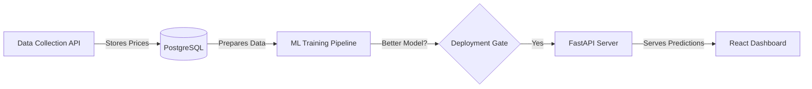

# iFly — Flight Price Intelligence System


A production-grade flight price prediction system that collects live airline pricing data, trains self-improving machine learning models, and deploys them through an automated pipeline — all orchestrated through a real-time React dashboard.

🌐 **[Live Demo](https://i-fly-two.vercel.app)** · 📡 **[API Docs](https://ifly-fam5.onrender.com/docs)** · 📊 **[Backend Health](https://ifly-fam5.onrender.com/health)**

---

## 🚀 Key Features

*   **Live Data Collection:** Automatically fetches flight data twice daily using a robust failover system across three data sources to ensure continuous data flow.
*   **Leakage-Proof Machine Learning:** Uses SQL window functions for chronological feature engineering, strictly preventing future data from skewing model training.
*   **Self-Improving Models:** Automatically retrains weekly. A strict deployment gate promotes a new model to production *only* if it outperforms the current one on identical test data.
*   **Interactive Dashboard:** React-based UI for real-time price predictions, full visibility into model metrics, and system health monitoring.
*   **Built-in Stress Testing:** Equipped with an automated stress test engine to verify the reliability of the prediction API under load.

---

## ⚙️ How It Works


```mermaid
graph LR
    Data[Data Collection API] --> |Stores Prices| DB[(PostgreSQL)]
    DB --> |Prepares Data| ML[ML Training Pipeline]
    ML --> |Better Model?| Gate{Deployment Gate}
    Gate --> |Yes| API[FastAPI Server]
    API --> |Serves Predictions| UI[React Dashboard]
```

---

## 💻 Tech Stack

*   **Frontend:** React, Vite, TailwindCSS
*   **Backend:** FastAPI, SQLAlchemy, Alembic
*   **Machine Learning:** XGBoost, scikit-learn
*   **Database:** PostgreSQL (Supabase)
*   **Hosting:** Vercel (Frontend), Render (Backend), GitHub Actions (Cron Jobs)

---

## 🛠️ Quick Start (Run Locally)

### Prerequisites

*   Python 3.11+
*   Node.js 18+
*   PostgreSQL database (or Supabase instance)

### Backend Setup

```bash
cd backend
python -m venv venv
source venv/bin/activate
pip install -r requirements.txt

# Configure environment variables
cp .env.example .env
# Edit .env with your DATABASE_URL

# Run database migrations
alembic upgrade head

# Start the API server
uvicorn app.main:app --reload --port 8000
```

*The API will be available at `http://localhost:8000/docs`*

### Frontend Setup

```bash
cd frontend
npm install

# Setup environment variables (defaults to localhost:8000)
cp .env.example .env

# Start the development server
npm run dev
```

*The dashboard will be available at `http://localhost:5173`*

---

## ☁️ Deployment

*   **Backend:** Deploy via Render. Set the root directory to `backend`, build command to `pip install -r requirements.txt`, and start command to `uvicorn app.main:app --host 0.0.0.0 --port $PORT`. Ensure you provide your database and API credentials in the environment variables.
*   **Frontend:** Deploy via Vercel. Select Vite as the framework and specify `frontend` as the root directory. Provide `VITE_API_BASE_URL` in the environment variables.

> **💡 Want to learn more about the architecture?**  
> For an in-depth dive into the ML approach, multi-provider ingestion, permutation testing, and our production safeguards, please see [`ARCHITECTURE_NOTES.md`](./ARCHITECTURE_NOTES.md).

---

## 📄 License

MIT
